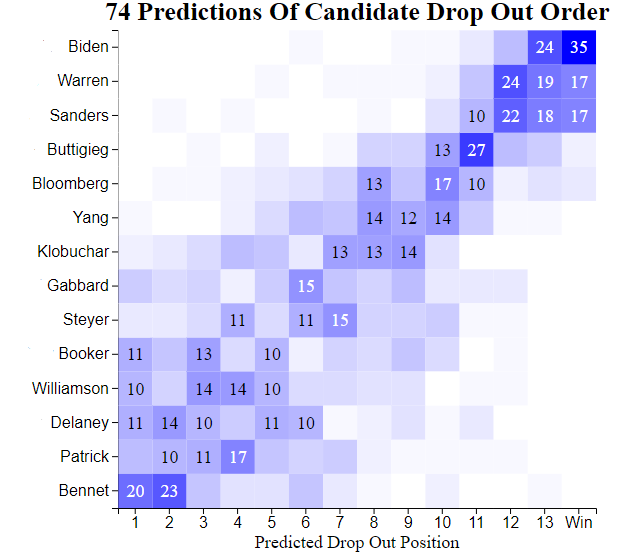

# Presidential Primary Dropout Contests

During the 2020 Democratic presidential primary, I ran a contest in which participants predicted the drop out order of the final 14 candidates still running as of January. I will be hosting the contest again for the 2024 Republican primary, with a better submission form, a sleeker website, and much more automation. 

## 2020 folder

`index.html`, `css/style.css`, and `js/script.js` are the files behind the <a href="https://cultureplot.com/dem-drop-out-contest/">contest leaderboard</a>.

`python/dropout-contest-scoring.ipynb` is a notebook for computing each participant's score as presidential candidates suspended their campaigns. Yes, I manually re-ran this notebook each time a candidate dropped out...I had a lot to learn. At least it was only 12 times 🤷. 

`python/heatmap.ipynb` is a notebook for generating a heatmap visualization of all the drop out predictions. Reads data from the submission dataset, which is not published in this repository. A first draft for what I later recreated using D3.js:

